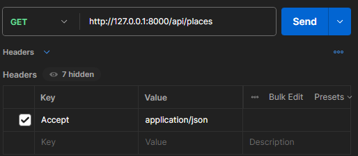
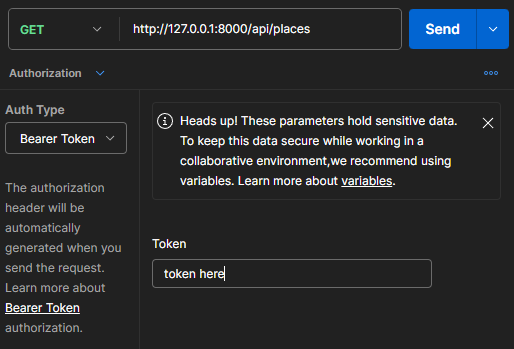

## How to configure
#### configure .env file
- remember to change the database information
#### up app
    docker compose up
#### run migrations
    docker exec laravelapp php artisan migrate
## obs
- add Accept application/json to the request header in Postman, insomnia, etc.

- Remember to add token in the Auth(Bearer token).

## Routes
- GET "api/places" -- list all places
- GET "api/places/{place}" -- show a place
- GET "api/user" -- show the current user (need to be logged in)
- POST "api/register" -- register a new user
    - needed fields: name, email, password and password_confirmation;
- POST "api/login" -- login a user
    - needed fields: email and password;
- POST "api/logout" -- logout a user (need to be logged in)
- POST "api/places" -- create a new place (need to be logged in)
    - needed fields: name, slug, city, state;
- PUT "api/places/{place}" -- update a place (need to be logged in)
- DELETE "api/places/{place}" -- delete a place (need to be logged in)